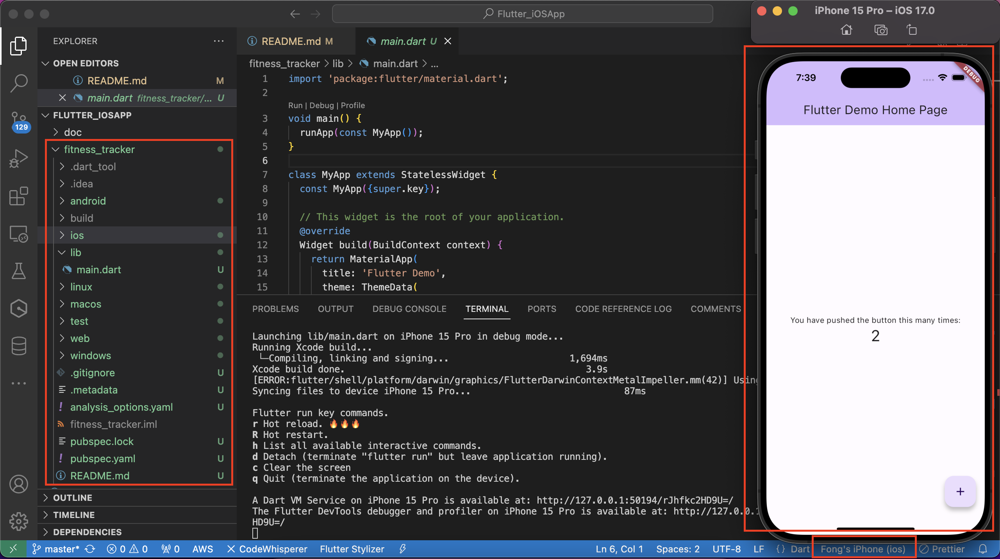
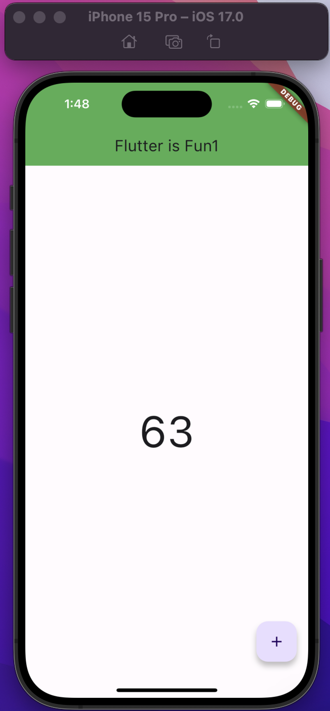
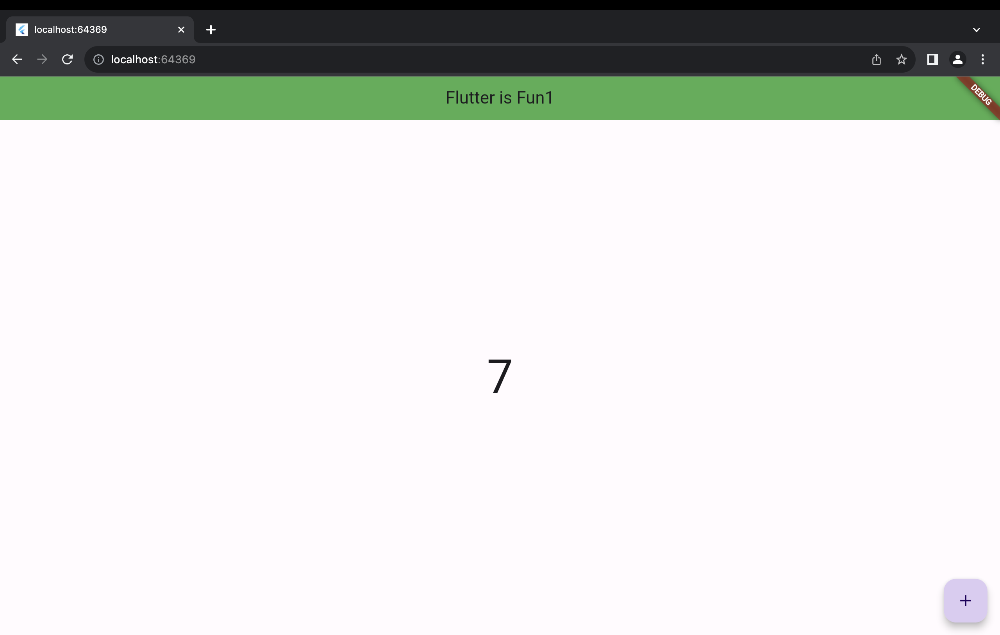

# Flutter_iOSApp

A repo of a project to learn Flutter framework to build iOS application.

## Create a iOS app project

- Setup

```sh
# replaces your current version of Flutter with the stable version
flutter channel stable

# update the Flutter SDK
flutter upgrade

# List all connected devices.
flutter devices

# optional
# Enable web app
flutter config --enable-web
```

- Creating a new project using CLI

```sh
flutter create fitness_tracker
```

- First run

```sh
cd fitness_tracker
flutter run
```



---

## Go through basic

- ref:

  - https://youtu.be/1xipg02Wu8s?si=J8yzvvZKhf-xfRPR

- iOS App





---

## Documentation

- [Doc V0.1](./doc/v0_1.md)
